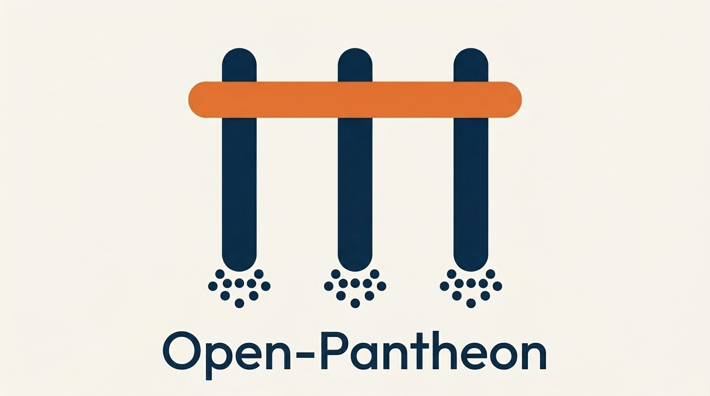

<div align="center">
  

  <h1>Open-Pantheon</h1>
  <p><strong>Multi-CLI AI Orchestration Framework — 97% Token Savings</strong></p>

  <p>
    
    
    
    
  </p>
</div>

---

## Overview

Open-Pantheon is a unified AI orchestration framework that combines Git repository analysis, portfolio generation, and full dev lifecycle automation into a single agent ecosystem. Claude Code orchestrates the pipeline while Codex CLI handles code analysis/validation and Gemini CLI generates design assets — achieving 97% token savings through intelligent agent routing and incremental context loading.

## Key Features

- **Automated Portfolio Generation** — Analyze any Git repo and generate a unique, design-profiled portfolio site in one command
- **13-State Pipeline** — Full state machine with quality gates and feedback loops across Analyze, Design, Build, Validate, and Deploy phases
- **CLI-First Multi-AI Architecture** — Claude Code (orchestration), Codex CLI (review/validation, `--sandbox ro`), Gemini CLI (design/visual, `-y`)
- **27 Specialized Agents** — 2 CLI-First + 7 Craft Pipeline + 18 Dev Lifecycle agents with keyword-matched auto-routing
- **Dev Lifecycle Management** — Feature development, sprint tracking, quality gates (pre-commit through post-release), and CI/CD automation
- **14 Slash Commands** — `/craft`, `/feature`, `/bugfix`, `/release`, `/phase`, and more for end-to-end workflow control

## Tech Stack

| Category | Technologies |
|----------|-------------|
| Orchestration | Claude Code (Lead) |
| AI Providers | Codex CLI (Review, Search, Validate), Gemini CLI (Design, Visual, SVG) |
| Templates | SvelteKit 5 Dashboard, Astro 5 Landing |
| Pipeline | 13-state machine, 6 quality gates, 8 automation hooks |
| Deployment | GitHub Pages, Vercel, Netlify |

## At a Glance

| Metric | Count |
|:--|------:|
| AI Agents | **27** |
| CLI Providers | **3** |
| Skills | **29** |
| Slash Commands | **14** |
| Hooks | **8** |
| Quality Gates | **6** |
| Design Palettes | **4** |

## Getting Started

```bash
# 1. Clone
git clone https://github.com/tygwan/open-pantheon.git
cd open-pantheon

# 2. Open in Claude Code
claude

# 3. Generate a portfolio for your project
/craft /path/to/your-project --deploy github-pages

# 4. Check project state
/craft-state my-project inspect
```

## License

MIT
